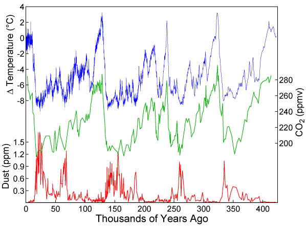

# Extracting Coordinate of Points on an Image of a Graph

## What to be done

There is an image file of a graph. The goal is to extract the coordinates of the points on the graph for further analysis.

## Explanation

There are three series on the graph. Each is red, green, and blue respectively. Each has its own y axis. They share the same x axis.

## Strategy

1. Extract red, green, and blue pixels from the image
2. Transform the coordinate of each pixel to fit the x and y axis on the graph
3. Plot the coordinates to validate the process
4. Save the coordinates as a csv file

## Results

The coordinates were properly extracted and saved on csv files.
